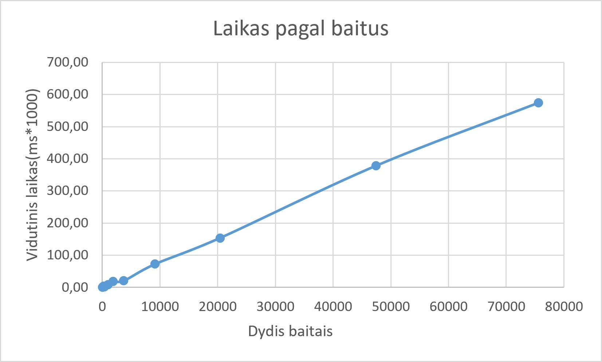

# blockchain_technologies

## Pradine versija v0.1

### apie funkcija int gautiBaitus(string t)

Iš pradžių nusprendžiau kiekvieną įvesto teksto baitą paversti jo skaitine reikšme. Gautas reikšmes sudedu ir saugau kintamajame visiBaitai.
Tačiau pastebėjau, kad paprasčiausiai sudedant baitų reikšmes įvyksta kolizija tarp skirtingų įvesčių, pavyzdžiui, „ab“ ir „ba“. Siekdamas to išvengti, nusprendžiau kiekvieno baito reikšmę padauginti iš jo pozicijos tekste: pirmąjį iš 1, antrąjį iš 2 ir t. t.
Atlikęs pirmuosius bandymus pastebėjau, kad šis pakeitimas neišsprendžia visų kolizijų problemos. Pavyzdžiui, skirtingos įvestys „ac“ ir „cb“ vis tiek duoda vienodą rezultatą. Todėl algoritmą reikia toliau tobulinti.

### apie funkcija std::array<uint32_t, 8> gautiHash(string t)

Pradinis šios funkcijos veikimo principas panašus į ankstesnės funkcijos: kiekvieno įvesties baito skaitinė reikšmė dauginama iš jo pozicijos. Tačiau šį kartą gauti rezultatai paskirstomi į aštuonis 32 bitų masyvo elementus. Tai leidžia išvengti anksčiau pastebėtos kolizijos tarp „ac“ ir „cb“, tačiau negarantuoja, kad kolizijų nebus tarp kitų įvesčių.
Siekdamas toliau patobulinti algoritmą, nusprendžiau prie kiekvieno maišos elemento pridėti ankstesnio elemento reikšmę. Tokiu būdu kiekvienas naujas elementas priklauso ne tik nuo dabartinio įvesties baito, bet ir nuo ankstesnių skaičiavimų rezultatų. Šiuo pakeitimu siekiu geriau susieti maišos elementus ir sumažinti lengvai aptinkamų kolizijų skaičių.

## Versija v0.11

### Pradiniai pakeitimai

Patobulinau koda, kad galima butu nuskaityti tekstinius failus, o ne tik ivesti teksta ranka.

### 1 eksperimentas

Sukuriau tuščią failą ir failus, turinčius tiksliai vieną baitą, a ir b, be naujos eilutės simbolio. Tris ASCII turinio failai 1000, 2000 ir 3000 baitų ilgio. Šių failų kopijas, kuriose pakeistas tiksliai vienas baitas pradžioje - padaryta su 1000 ilgio failu, viduryje - su 2000, pabaigoje - su 3000 ilgio failu. Keli struktūruoti atvejai: pasikartojančių simbolių failas pasikartojantys.txt, pakeista simbolių tvarka failuose ab.txt ir ba.txt, tarpai pradžioje tarpas_pradzioje.txt / pabaigoje tarpas_pabaigoje.txt ir tas
pats tekstas su naujos eilutės simboliu nauja_eilute.txt bei be jo be_eilutes.
Bent vienas UTF-8 pavyzdys su ne ASCII simboliais faile utf8.txt.
Patikrinimai po šio eksperimento buvo šie:
Nuskaičius tuščią failą, ekrane matome išvesta - 0000000000000000000000000000000000000000000000000000000000000000.
Nuskaičius failus po vieną baitą -
a.txt - 0000006100000000000000000000000000000000000000000000000000000000,
b.txt - 0000006200000000000000000000000000000000000000000000000000000000, kadangi a ir b skiriasi vienetu ascii koduotėje, todėl ir hash jų skirtumas yra tik viename simbolyje.
Failo su 1000 ir pakeisto pradinio simbolio su 1000 hash formatai -
004d99920c98cfe792ea6310c83d6e67846a7afefc544eb87107f8f9b327389d,
004d997b0c98c4ac92e79f8bc7c86ebe75ca85de8302341881bfb8191095e83d.
Failo su 2000 ir pakeisto viduje simbolio su 2000 hash formatai -
013163b7663026f925af072bf64b9feb77e2781cecafa4b3c39eec1652aabe78,
013163b76630779525d8e8370141860f651bec706e5117dba3803f5e6fe939f0.
Failo su 3000 ir pakeisto gale simbolio su 3000 hash formatai -
02c0b2ac5296c4d0770a1773dc2ce08977a19c8b05f5226ed42aedf7c64aafcf,
02c0b2ac5296c4d0770a1773dc2ce08977a19c8b05f5226ed42aedf7c64cbf27.
Failas su pasikartojančiais simboliais gauna reikšmę -
000003ca000008b700000246000003ca000005af000007f500000a9c00000da4.
Failai, kuriuose simboliai sukeisti vietomis ab ir ba -
ab - 0000006100000125000000000000000000000000000000000000000000000000,
ba - 0000006200000124000000000000000000000000000000000000000000000000.
Su tarpais pradzioje ir pabaigoje -
pradzioje - 00000020000000b8000001db0000036300000548000007fa0000000000000000,
pabaigoje - 0000004c0000010e00000234000003b8000005f7000006b70000000000000000.
Tas pats tekstas su nauja eilute po jo -
0000004c0000010e00000234000003b8000005f7000006450000068b00000000,
be naujos eilutės - 0000004c0000010e00000234000003b8000005f7000000000000000000000000.
Tekstas su lietuviškomis raidemis - Ąžuolas - simbilių skaičius jame yra 7, o baitu išvedama 9,
000004cf000001cc0000041b000007130000095c00000bf600000eea000011f2.

### Eksperimento išvados

Atlikus pirmąjį eksperimentą nustatyta, kad programa geba apskaičiuoti maišas tuščiam failui, vieno baito failams, skirtingo dydžio ASCII failams ir UTF-8 tekstui su lietuviškomis raidėmis. Tuščio failo maišą sudaro vien nuliai. Vieno baito failų a.txt ir b.txt maišos skiriasi tik vienu šešioliktainiu skaitmeniu, arba dviem bitais.
Pakeitus vieną baitą didesniuose failuose, gautos skirtingos maišos, tačiau pastebėta, kad pakeitimas failo pabaigoje paveikia tik dalį maišos. Tai rodo, kad dabartinėje algoritmo versijoje įvesties pakeitimai nepakankamai pasklinda po visą 256 bitų išvestį.
Struktūruotų įvesčių bandymai parodė, kad simbolių tvarkos pakeitimas, tarpo pozicija ir papildomi naujos eilutės baitai gali pakeisti gaunamą maišą. UTF-8 bandyme tekstą Ąžuolas sudarė 7 simboliai ir 9 baitai, todėl patvirtinta, kad baitų skaičius nebūtinai sutampa su simbolių skaičiumi.

## Versija v0.12

### 2 eksperimentas

Atlikus testus su praeitame eksperimente sukurtais failais gauname tokias jų hex ir maišos ilgių reikšmes:
| Įvestis | Maiša(HEX) | Maišos ilgis |
|------------------------------|------------------------------------------------------------------|--------------|
| Tuščia | 0000000000000000000000000000000000000000000000000000000000000000 | 64 |
| Vienas baitas a | 0000006100000000000000000000000000000000000000000000000000000000 | 64 |
| Vienas baitas b | 0000006200000000000000000000000000000000000000000000000000000000 | 64 |
| 1000 ilgis | 004d99920c98cfe792ea6310c83d6e67846a7afefc544eb87107f8f9b327389d | 64 |
| 1000 ilgis su pirmu pakeistu | 004d997b0c98c4ac92e79f8bc7c86ebe75ca85de8302341881bfb8191095e83d | 64 |
| 2000 ilgis | 013163b7663026f925af072bf64b9feb77e2781cecafa4b3c39eec1652aabe78 | 64 |
| pakeistas viduje | 013163b76630779525d8e8370141860f651bec706e5117dba3803f5e6fe939f0 | 64 |
| 3000 ilgis | 02c0b2ac5296c4d0770a1773dc2ce08977a19c8b05f5226ed42aedf7c64aafcf | 64 |
| pakeistas paskutinis | 02c0b2ac5296c4d0770a1773dc2ce08977a19c8b05f5226ed42aedf7c64cbf27 | 64 |
| pasikartojantys a | 000003ca000008b700000246000003ca000005af000007f500000a9c00000da4 | 64 |
| ab | 0000006100000125000000000000000000000000000000000000000000000000 | 64 |
| ba | 0000006200000124000000000000000000000000000000000000000000000000 | 64 |
| tarpas pradžioje | 00000020000000b8000001db0000036300000548000007fa0000000000000000 | 64 |
| tarpas pabaigoje | 0000004c0000010e00000234000003b8000005f7000006b70000000000000000 | 64 |
| tekstas su eilute po juo | 0000004c0000010e00000234000003b8000005f7000006450000068b00000000 | 64 |
| be naujos eilutės | 0000004c0000010e00000234000003b8000005f7000000000000000000000000 | 64 |
| Ąžuolas | 000004cf000001cc0000041b000007130000095c00000bf600000eea000011f2 | 64 |
| Labas - ranka | 0000004c0000010e00000234000003b8000005f7000000000000000000000000 | 64 |
| Labas - nuskaitant | 0000004c0000010e00000234000003b8000005f7000000000000000000000000 | 64 |

#### Išvados

Atlikus testus matome, kad su bet kokio ilgio ir formato įvestimi gaunama fiksuoto 256 bitų ilgio maiša. Kadangi vienas HEX simbolis atitinka 4 bitus, 256 bitų maiša yra atvaizduojama 64 HEX simboliais. Visuose atliktuose testuose maišos ilgis buvo 64 simboliai, o pradiniai nuliai buvo išsaugomi.
Taip pat patikrinta, kad įvedus tą patį tekstą Labas rankiniu būdu ir nuskaičius tokį patį tekstą iš failo, kai sutampa įvesties baitai, gaunama identiška maišos reikšmė. Tai parodo, kad maišos rezultatas nepriklauso nuo įvesties būdo.

### 3 eksperimentas

Šio eksperimento tikslas buvo patikrinti maišos funkcijos determinizmą, t. y. ar tokia pati įvestis visada pateikia tokią pačią maišos reikšmę.

Pirmiausia buvo atliktas testas vieno programos paleidimo metu naudojant A–B–A seką. Iš pradžių apskaičiuota žodžio Labas maiša, tada žodžio Kebabas, o po to dar kartą žodžio Labas maiša.

| Žodis   | Maiša (HEX)                                                      |
| ------- | ---------------------------------------------------------------- |
| Labas   | 0000004c0000010e00000234000003b8000005f7000000000000000000000000 |
| Kebabas | 0000004b000001150000023b000003bf000005a9000007ef00000b1400000000 |
| Labas   | 0000004c0000010e00000234000003b8000005f7000000000000000000000000 |

Matome, kad abiem atvejais žodis Labas pateikė identišką maišos reikšmę. Tai parodo, kad ankstesnis maišos skaičiavimas nepaveikia vėlesnių funkcijos kvietimų.

Antroje eksperimento dalyje buvo patikrinta, ar tokia pati įvestis pateikia vienodą rezultatą atskirai paleidžiant programą iš naujo. Visais trimis paleidimais buvo naudojamas žodis Labas.

| Kartas  | Žodis | Maiša (HEX)                                                      |
| ------- | ----- | ---------------------------------------------------------------- |
| Pirmas  | Labas | 0000004c0000010e00000234000003b8000005f7000000000000000000000000 |
| Antras  | Labas | 0000004c0000010e00000234000003b8000005f7000000000000000000000000 |
| Trečias | Labas | 0000004c0000010e00000234000003b8000005f7000000000000000000000000 |

Visais trimis atskirais programos paleidimais gauta identiška maišos reikšmė.

#### Išvada

Atlikti testai parodė, kad dabartinė maišos funkcijos versija yra deterministinė: tokia pati įvestis pateikia tokią pačią maišos reikšmę tiek pakartotinai skaičiuojant vieno programos paleidimo metu, tiek programą paleidžiant iš naujo. A–B–A testas taip pat neparodė tarp funkcijos kvietimų išliekančios būsenos.

### 4 eksperimentas

Buvo pravestas eksperimentas apskaičiuoti kiek laiko užtrunka 1, 2, 4, 8, ir t.t. eilučių iš duoto tekstinio dokumento konstitucija.txt maišos generavimas. Apačioje esančioje lentelėje galite matyti eilučių skaičių, kiek į jas įėjo baitų, jų HEX formatą, vidutinį laiką milisekundėmis*1000 ir didžiausia su mažiausiu laiku irgi milisekundėmis*1000. Laikui apskaičiuoti buvo naudojama C++ biblioteka chrono bei ši funkcija:
for(int j = 0; j < 5; j++)
{
auto start = std::chrono::high_resolution_clock::now();
for(int k = 0; k < 1000; k++)
{
hash = gautiHash(istrauka);
}
auto end = std::chrono::high_resolution_clock::now();
std::chrono::duration<double, std::milli> elapsed = end - start;
cout << "Laikas: " << elapsed.count() << " ms" << endl;
}
Eksperimento metu kiekvienai ištraukai atlikti 5 atskiri matavimai. Vieno matavimo metu maišos funkcija buvo iškviesta 1000 kartų taip apskaičiuojant vidutinį vienos maišos skaičiavimo laiką lentelėje rodomas laikas milisekundėmis\*1000. Kiekvienam įvesties dydžiui apskaičiuotas penkių matavimų vidurkis, mažiausia ir didžiausia reikšmė.
| Eilučių skaičius | Baitu skaičius | Maiša(HEX) | Vidutinis laikas(ms \* 1000) | Did. laikas(ms) | Maž.laikas(ms) |
| ---------------- | -------------- | ---------------------------------------------------------------- | ---------------------------- | ---------------------- | --------------------- |
| 1 | 70 | 00005d660001ba010005a259000f98c500260aa100546a120059db1500a54fb5 | 0.79796 | 0.0010022 | 0.00000001 |
| 2 | 123 | 000101480007ce940028828d0081aba101bddbc3055d90130f1e26b027869f7a | 1.20338 | .0019955 | 0.0010007 |
| 4 | 205 | 00030e89001df53b00e184080580a27a1d78faed6d761a31c159584d95058c29 | 4.23952 | 0.0116019 | 0.00000001 |
| 8 | 362 | 000d6b4200c7d28d07f43a954a67e91861b1a92558a44abab8ef059582fa9378 | 2.19492 | 0.0103427 | 0.00000001 |
| 16 | 996 | 0066646f111720641609412a7a7dcc1347819cc8d4f182ed116b97afc94d56bd | 8.20568 | 0.0128488 | 0.0007749 |
| 32 | 1841 | 0150b282673416d1937cf0ada4ca27a9be4ee20f36a658e9871ba5370c74f054 | 18.21688 | 0.023.6288 | 0.0135984 |
| 64 | 3712 | 0581a2164ea0dd0e85b61fbe572b0f722fe8ecc9aee87ed1769bd81b0bbafa32 | 20.4027 | 0.037713 | 0.0191944 |
| 128 | 9155 | 213625ee98c6eef271c51e1c32e2ea4a6adb2b95070ed788127171fcd1d65c09 | 72.59696 | 0.0833963 | 0.0553751 |
| 256 | 20409 | a0bed7ec6bb3d1b03b93b60ec1a3f55f57da55fc36056ec431d46f449939c8c4 | 153.8694 | 0.156577 | 0.151717 |
| 512 | 47434 | 529adf1bfa425d0bda38fd5fb510a53327751a407cbaa7f5fa5d29ad3bd55927 | 378.6358 | 0.387494 | 0.351329 |
| 789 | 75595 | 75f90156b608fb2c2065f6c7a530e18f05d45c202cf0a86aac35db20498ba836 | 574.7552 | 0.601501 | 0.546858 |

Žemiau galite matyti laiko priklausomybės nuo baitų dydžio lentelę.

Matome, kad laikas didėjant baitų skaičiui irgi didėja, tačiau 8 eilučių laiko matavime matome anomaliją, nes vidutinis laikas vos ne dukart mažesnis negu 4 eilučių matavime. Visuose kituose matavimuose laiko tendencija išlieka tokia pati ir didėja.

### 5 eksperimentas

Pridėta funkcija generuoti atsitiktinius ASCII koduoties tekstus pagal nurodyta ilgi ir fiksuota seed reikšmę (pas mane 12345). Naudota abėcėlė : "abcdefghijklmnopqrstuvwxyzABCDEFGHIJKLMNOPQRSTUVWXYZ0123456789"; Pirmoje eksperimento dalyje kiekvienam ilgiui buvo sugeneruota po 100000 skirtingų tekstų porų ir palygintos kiekvienos maišos reikšmės.

| Ilgis | Kolizijų skaičius |
| ----- | ----------------- |
| 10    | 0                 |
| 100   | 0                 |
| 500   | 0                 |
| 1000  | 0                 |

Antroje eksperimento dalyje buvo tikrinamos ne tik kiekvienos poros dvi maišos reikšmės, bet ir ieškoma pasikartojančių maišos reikšmių tarp visų konkretaus ilgio sugeneruotų įvesčių, kurių skaičius irgi buvo 100000, naudojant unordered_map.
| Ilgis | Kolizijų skaičius |
| ----- | ----------------- |
| 10 | 0 |
| 100 | 0 |
| 500 | 0 |
| 1000 | 0 |
Matome, kad ir pirmu, poriniame, ir antru, viso rinkinio tikrinimo, atveju pavyko išvengti kolizijų, tačiau tai dar neįrodo kriptografinio saugumo, nes 256 bitų maišos atveju atsitiktinės kolizijos tikimybė labai maža, todėl greičiausiai eksperimento metu jų ir neaptikau.
Taip pat buvo patikrinta strukturuoti įvesčių rinkiniai - tekstas parašytas išvirkščiai ir pasikartojančiai. Tačiau ir šio bandymo metu nebuvo aptikta kolizijų.
| Įvestis A | Įvestis B | Hash A == Hash B |
|---|---|---|
| `abcdefghij` | `jihgfedcba` | Ne |
| `ababababab` | `bababababa` | Ne |
| `aaaaaaaaaa` | `bbbbbbbbbb` | Ne |

### 6 eksperimentas

Šio eksperimento tikslas buvo patikrinti mano maišos funkcijos lavinos efektą. Iš viso buvo sugeneruota 100000 porų, po 25000 porų kiekvienam įvesties ilgiui; 10, 100, 500, 1000 simbolių. Kiekvienoje poroje antroji sudaryta įvesti susidėjo iš pirmosios pakeičiant vieną atsitiktinį simbolį, nekeičiant įvesties ilgio.
Maišos buvo lyginamos dviem būdais:

- bitų skirtumas, apskaičiuojama, kiek procentų iš 256 maišos bitų skiriasi;
- HEX skirtumas, apskaičiuojama, kiek procentų iš 64 HEX skaitmenų pozicijų skiriasi.
  Gauti rezultatai:
  | Ilgis | Vidurkis(hex) | Min(hex) | Max(hex) | Vidurkis(bitai) | Min(bitai) | Max(bitai) |
  |-------|---------------|----------|----------|-----------------|------------|------------|
  | 10 | 13% | 2% | 34% | 7% | 0,4% | 23% |
  | 100 | 26% | 2% | 69% | 13% | 0,4% | 40% |
  | 500 | 37% | 2% | 89% | 19% | 0,4% | 52% |
  | 1000 | 40% | 2% | 94% | 21% | 0,4% | 54% |

#### Išvados

Rezultatai parodė, kad didėjant įvesties ilgiui lavinos efektas gerėja. 10 simbolių įvestims vidutiniškai skyrėsi apie 7% maišos bitų ir 13% HEX skaitmenų, o 1000 simbolių įvestims šios reikšmės padidėjo atitinkamai iki maždaug 21% ir 40%.
Vis dėlto šie vidurkiai yra gerokai mažesni už orientacines nepriklausomų ir tolygiai pasiskirsčiusių maišos išvesčių reikšmes pateiktas užduotyje.
Mažiausias užfiksuotas bitų skirtumas buvo apie 0,4%, tai reiškia, kad kai kuriais atvejais pakeitus vieną įvesties simbolį pasikeitė tik labai maža 256 bitų maišos dalis. Mažiausias HEX skirtumas buvo apie 2%.
Maksimalios reikšmės ilgesnėms įvestims kai kuriais atvejais priartėjo prie orientacinių reikšmių. Pavyzdžiui, 1000 simbolių įvestims didžiausias HEX skirtumas siekė 94%, o bitų skirtumas – 54%. Tačiau pavieniai geri rezultatai nepakeičia bendros tendencijos, nes vidutinės reikšmės išlieka gerokai mažesnės už orientacines.
Todėl galima teigti, kad dabartinė maišos funkcijos versija turi silpną lavinos efektą, nors ilgėjant įvesčiai jis pastebimai gerėja.
Geras lavinos efektas savaime neįrodo atsparumo kolizijoms. Funkcija teoriškai galėtų stipriai pakeisti išvestį pakeitus vieną simbolį, tačiau vis tiek turėti lengvai randamų skirtingų įvesčių su vienoda maiša. Tokias silpnybes geriau atskleidžia 5 eksperimente atliktas kolizijų tikrinimas.
