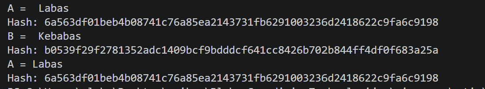
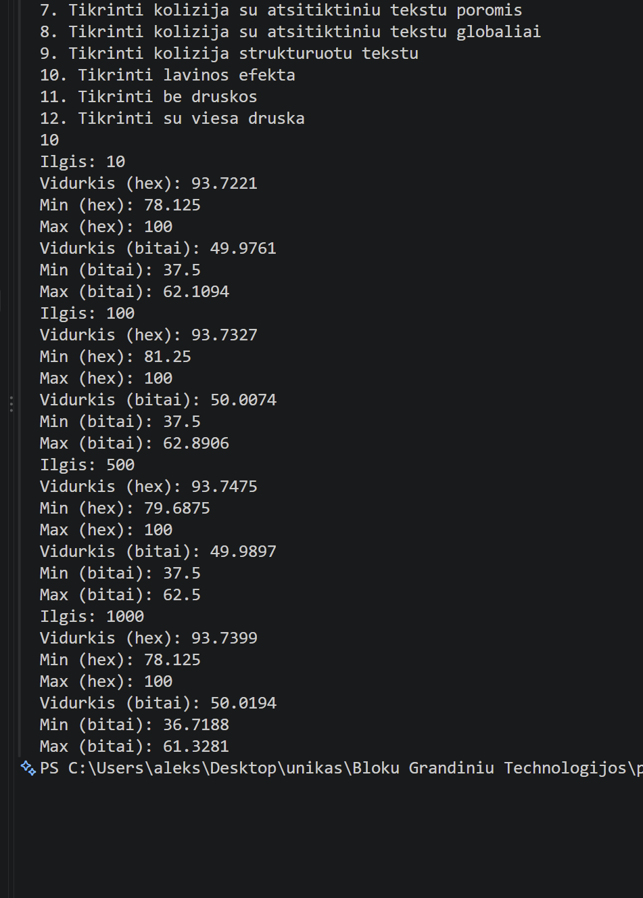

# blockchain_technologies

## Pradine versija v0.1

### apie funkcija int gautiBaitus(string t)

Iš pradžių nusprendžiau kiekvieną įvesto teksto baitą paversti jo skaitine reikšme. Gautas reikšmes sudedu ir saugau kintamajame visiBaitai.
Tačiau pastebėjau, kad paprasčiausiai sudedant baitų reikšmes įvyksta kolizija tarp skirtingų įvesčių, pavyzdžiui, „ab“ ir „ba“. Siekdamas to išvengti, nusprendžiau kiekvieno baito reikšmę padauginti iš jo pozicijos tekste: pirmąjį iš 1, antrąjį iš 2 ir t. t.
Atlikęs pirmuosius bandymus pastebėjau, kad šis pakeitimas neišsprendžia visų kolizijų problemos. Pavyzdžiui, skirtingos įvestys „ac“ ir „cb“ vis tiek duoda vienodą rezultatą. Todėl algoritmą reikia toliau tobulinti.

### apie funkcija std::array<uint32_t, 8> gautiHash(string t)

Pradinis šios funkcijos veikimo principas panašus į ankstesnės funkcijos: kiekvieno įvesties baito skaitinė reikšmė dauginama iš jo pozicijos. Tačiau šį kartą gauti rezultatai paskirstomi į aštuonis 32 bitų masyvo elementus. Tai leidžia išvengti anksčiau pastebėtos kolizijos tarp „ac“ ir „cb“, tačiau negarantuoja, kad kolizijų nebus tarp kitų įvesčių.
Siekdamas toliau patobulinti algoritmą, nusprendžiau prie kiekvieno maišos elemento pridėti ankstesnio elemento reikšmę. Tokiu būdu kiekvienas naujas elementas priklauso ne tik nuo dabartinio įvesties baito, bet ir nuo ankstesnių skaičiavimų rezultatų. Šiuo pakeitimu siekiu geriau susieti maišos elementus ir sumažinti lengvai aptinkamų kolizijų skaičių.

## Versija v0.11

### Pradiniai pakeitimai

Patobulinau koda, kad galima butu nuskaityti tekstinius failus, o ne tik ivesti teksta ranka.

### 1 eksperimentas

Sukuriau tuščią failą ir failus, turinčius tiksliai vieną baitą, a ir b, be naujos eilutės simbolio. Tris ASCII turinio failai 1000, 2000 ir 3000 baitų ilgio. Šių failų kopijas, kuriose pakeistas tiksliai vienas baitas pradžioje - padaryta su 1000 ilgio failu, viduryje - su 2000, pabaigoje - su 3000 ilgio failu. Keli struktūruoti atvejai: pasikartojančių simbolių failas pasikartojantys.txt, pakeista simbolių tvarka failuose ab.txt ir ba.txt, tarpai pradžioje tarpas_pradzioje.txt / pabaigoje tarpas_pabaigoje.txt ir tas
pats tekstas su naujos eilutės simboliu nauja_eilute.txt bei be jo be_eilutes.
Bent vienas UTF-8 pavyzdys su ne ASCII simboliais faile utf8.txt.
Patikrinimai po šio eksperimento buvo šie:
Nuskaičius tuščią failą, ekrane matome išvesta - 0000000000000000000000000000000000000000000000000000000000000000.
Nuskaičius failus po vieną baitą -
a.txt - 0000006100000000000000000000000000000000000000000000000000000000,
b.txt - 0000006200000000000000000000000000000000000000000000000000000000, kadangi a ir b skiriasi vienetu ascii koduotėje, todėl ir hash jų skirtumas yra tik viename simbolyje.
Failo su 1000 ir pakeisto pradinio simbolio su 1000 hash formatai -
004d99920c98cfe792ea6310c83d6e67846a7afefc544eb87107f8f9b327389d,
004d997b0c98c4ac92e79f8bc7c86ebe75ca85de8302341881bfb8191095e83d.
Failo su 2000 ir pakeisto viduje simbolio su 2000 hash formatai -
013163b7663026f925af072bf64b9feb77e2781cecafa4b3c39eec1652aabe78,
013163b76630779525d8e8370141860f651bec706e5117dba3803f5e6fe939f0.
Failo su 3000 ir pakeisto gale simbolio su 3000 hash formatai -
02c0b2ac5296c4d0770a1773dc2ce08977a19c8b05f5226ed42aedf7c64aafcf,
02c0b2ac5296c4d0770a1773dc2ce08977a19c8b05f5226ed42aedf7c64cbf27.
Failas su pasikartojančiais simboliais gauna reikšmę -
000003ca000008b700000246000003ca000005af000007f500000a9c00000da4.
Failai, kuriuose simboliai sukeisti vietomis ab ir ba -
ab - 0000006100000125000000000000000000000000000000000000000000000000,
ba - 0000006200000124000000000000000000000000000000000000000000000000.
Su tarpais pradzioje ir pabaigoje -
pradzioje - 00000020000000b8000001db0000036300000548000007fa0000000000000000,
pabaigoje - 0000004c0000010e00000234000003b8000005f7000006b70000000000000000.
Tas pats tekstas su nauja eilute po jo -
0000004c0000010e00000234000003b8000005f7000006450000068b00000000,
be naujos eilutės - 0000004c0000010e00000234000003b8000005f7000000000000000000000000.
Tekstas su lietuviškomis raidemis - Ąžuolas - simbilių skaičius jame yra 7, o baitu išvedama 9,
000004cf000001cc0000041b000007130000095c00000bf600000eea000011f2.

### Eksperimento išvados

Atlikus pirmąjį eksperimentą nustatyta, kad programa geba apskaičiuoti maišas tuščiam failui, vieno baito failams, skirtingo dydžio ASCII failams ir UTF-8 tekstui su lietuviškomis raidėmis. Tuščio failo maišą sudaro vien nuliai. Vieno baito failų a.txt ir b.txt maišos skiriasi tik vienu šešioliktainiu skaitmeniu, arba dviem bitais.
Pakeitus vieną baitą didesniuose failuose, gautos skirtingos maišos, tačiau pastebėta, kad pakeitimas failo pabaigoje paveikia tik dalį maišos. Tai rodo, kad dabartinėje algoritmo versijoje įvesties pakeitimai nepakankamai pasklinda po visą 256 bitų išvestį.
Struktūruotų įvesčių bandymai parodė, kad simbolių tvarkos pakeitimas, tarpo pozicija ir papildomi naujos eilutės baitai gali pakeisti gaunamą maišą. UTF-8 bandyme tekstą Ąžuolas sudarė 7 simboliai ir 9 baitai, todėl patvirtinta, kad baitų skaičius nebūtinai sutampa su simbolių skaičiumi.

## Versija v0.12

### 2 eksperimentas

Atlikus testus su praeitame eksperimente sukurtais failais gauname tokias jų hex ir maišos ilgių reikšmes:
| Įvestis | Maiša(HEX) | Maišos ilgis |
|------------------------------|------------------------------------------------------------------|--------------|
| Tuščia | 0000000000000000000000000000000000000000000000000000000000000000 | 64 |
| Vienas baitas a | 0000006100000000000000000000000000000000000000000000000000000000 | 64 |
| Vienas baitas b | 0000006200000000000000000000000000000000000000000000000000000000 | 64 |
| 1000 ilgis | 004d99920c98cfe792ea6310c83d6e67846a7afefc544eb87107f8f9b327389d | 64 |
| 1000 ilgis su pirmu pakeistu | 004d997b0c98c4ac92e79f8bc7c86ebe75ca85de8302341881bfb8191095e83d | 64 |
| 2000 ilgis | 013163b7663026f925af072bf64b9feb77e2781cecafa4b3c39eec1652aabe78 | 64 |
| pakeistas viduje | 013163b76630779525d8e8370141860f651bec706e5117dba3803f5e6fe939f0 | 64 |
| 3000 ilgis | 02c0b2ac5296c4d0770a1773dc2ce08977a19c8b05f5226ed42aedf7c64aafcf | 64 |
| pakeistas paskutinis | 02c0b2ac5296c4d0770a1773dc2ce08977a19c8b05f5226ed42aedf7c64cbf27 | 64 |
| pasikartojantys a | 000003ca000008b700000246000003ca000005af000007f500000a9c00000da4 | 64 |
| ab | 0000006100000125000000000000000000000000000000000000000000000000 | 64 |
| ba | 0000006200000124000000000000000000000000000000000000000000000000 | 64 |
| tarpas pradžioje | 00000020000000b8000001db0000036300000548000007fa0000000000000000 | 64 |
| tarpas pabaigoje | 0000004c0000010e00000234000003b8000005f7000006b70000000000000000 | 64 |
| tekstas su eilute po juo | 0000004c0000010e00000234000003b8000005f7000006450000068b00000000 | 64 |
| be naujos eilutės | 0000004c0000010e00000234000003b8000005f7000000000000000000000000 | 64 |
| Ąžuolas | 000004cf000001cc0000041b000007130000095c00000bf600000eea000011f2 | 64 |
| Labas - ranka | 0000004c0000010e00000234000003b8000005f7000000000000000000000000 | 64 |
| Labas - nuskaitant | 0000004c0000010e00000234000003b8000005f7000000000000000000000000 | 64 |

#### Išvados

Atlikus testus matome, kad su bet kokio ilgio ir formato įvestimi gaunama fiksuoto 256 bitų ilgio maiša. Kadangi vienas HEX simbolis atitinka 4 bitus, 256 bitų maiša yra atvaizduojama 64 HEX simboliais. Visuose atliktuose testuose maišos ilgis buvo 64 simboliai, o pradiniai nuliai buvo išsaugomi.
Taip pat patikrinta, kad įvedus tą patį tekstą Labas rankiniu būdu ir nuskaičius tokį patį tekstą iš failo, kai sutampa įvesties baitai, gaunama identiška maišos reikšmė. Tai parodo, kad maišos rezultatas nepriklauso nuo įvesties būdo.

### 3 eksperimentas

Šio eksperimento tikslas buvo patikrinti maišos funkcijos determinizmą, t. y. ar tokia pati įvestis visada pateikia tokią pačią maišos reikšmę.

Pirmiausia buvo atliktas testas vieno programos paleidimo metu naudojant A–B–A seką. Iš pradžių apskaičiuota žodžio Labas maiša, tada žodžio Kebabas, o po to dar kartą žodžio Labas maiša.

| Žodis   | Maiša (HEX)                                                      |
| ------- | ---------------------------------------------------------------- |
| Labas   | 0000004c0000010e00000234000003b8000005f7000000000000000000000000 |
| Kebabas | 0000004b000001150000023b000003bf000005a9000007ef00000b1400000000 |
| Labas   | 0000004c0000010e00000234000003b8000005f7000000000000000000000000 |

Matome, kad abiem atvejais žodis Labas pateikė identišką maišos reikšmę. Tai parodo, kad ankstesnis maišos skaičiavimas nepaveikia vėlesnių funkcijos kvietimų.

Antroje eksperimento dalyje buvo patikrinta, ar tokia pati įvestis pateikia vienodą rezultatą atskirai paleidžiant programą iš naujo. Visais trimis paleidimais buvo naudojamas žodis Labas.

| Kartas  | Žodis | Maiša (HEX)                                                      |
| ------- | ----- | ---------------------------------------------------------------- |
| Pirmas  | Labas | 0000004c0000010e00000234000003b8000005f7000000000000000000000000 |
| Antras  | Labas | 0000004c0000010e00000234000003b8000005f7000000000000000000000000 |
| Trečias | Labas | 0000004c0000010e00000234000003b8000005f7000000000000000000000000 |

Visais trimis atskirais programos paleidimais gauta identiška maišos reikšmė.

#### Išvada

Atlikti testai parodė, kad dabartinė maišos funkcijos versija yra deterministinė: tokia pati įvestis pateikia tokią pačią maišos reikšmę tiek pakartotinai skaičiuojant vieno programos paleidimo metu, tiek programą paleidžiant iš naujo. A–B–A testas taip pat neparodė tarp funkcijos kvietimų išliekančios būsenos.

### 4 eksperimentas

Buvo pravestas eksperimentas apskaičiuoti kiek laiko užtrunka 1, 2, 4, 8, ir t.t. eilučių iš duoto tekstinio dokumento konstitucija.txt maišos generavimas. Apačioje esančioje lentelėje galite matyti eilučių skaičių, kiek į jas įėjo baitų, jų HEX formatą, vidutinį laiką milisekundėmis*1000 ir didžiausia su mažiausiu laiku irgi milisekundėmis*1000. Laikui apskaičiuoti buvo naudojama C++ biblioteka chrono bei ši funkcija:
for(int j = 0; j < 5; j++)
{
auto start = std::chrono::high_resolution_clock::now();
for(int k = 0; k < 1000; k++)
{
hash = gautiHash(istrauka);
}
auto end = std::chrono::high_resolution_clock::now();
std::chrono::duration<double, std::milli> elapsed = end - start;
cout << "Laikas: " << elapsed.count() << " ms" << endl;
}
Eksperimento metu kiekvienai ištraukai atlikti 5 atskiri matavimai. Vieno matavimo metu maišos funkcija buvo iškviesta 1000 kartų taip apskaičiuojant vidutinį vienos maišos skaičiavimo laiką lentelėje rodomas laikas milisekundėmis\*1000. Kiekvienam įvesties dydžiui apskaičiuotas penkių matavimų vidurkis, mažiausia ir didžiausia reikšmė.
| Eilučių skaičius | Baitu skaičius | Maiša(HEX) | Vidutinis laikas(ms \* 1000) | Did. laikas(ms) | Maž.laikas(ms) |
| ---------------- | -------------- | ---------------------------------------------------------------- | ---------------------------- | ---------------------- | --------------------- |
| 1 | 70 | 00005d660001ba010005a259000f98c500260aa100546a120059db1500a54fb5 | 0.79796 | 0.0010022 | 0.00000001 |
| 2 | 123 | 000101480007ce940028828d0081aba101bddbc3055d90130f1e26b027869f7a | 1.20338 | .0019955 | 0.0010007 |
| 4 | 205 | 00030e89001df53b00e184080580a27a1d78faed6d761a31c159584d95058c29 | 4.23952 | 0.0116019 | 0.00000001 |
| 8 | 362 | 000d6b4200c7d28d07f43a954a67e91861b1a92558a44abab8ef059582fa9378 | 2.19492 | 0.0103427 | 0.00000001 |
| 16 | 996 | 0066646f111720641609412a7a7dcc1347819cc8d4f182ed116b97afc94d56bd | 8.20568 | 0.0128488 | 0.0007749 |
| 32 | 1841 | 0150b282673416d1937cf0ada4ca27a9be4ee20f36a658e9871ba5370c74f054 | 18.21688 | 0.023.6288 | 0.0135984 |
| 64 | 3712 | 0581a2164ea0dd0e85b61fbe572b0f722fe8ecc9aee87ed1769bd81b0bbafa32 | 20.4027 | 0.037713 | 0.0191944 |
| 128 | 9155 | 213625ee98c6eef271c51e1c32e2ea4a6adb2b95070ed788127171fcd1d65c09 | 72.59696 | 0.0833963 | 0.0553751 |
| 256 | 20409 | a0bed7ec6bb3d1b03b93b60ec1a3f55f57da55fc36056ec431d46f449939c8c4 | 153.8694 | 0.156577 | 0.151717 |
| 512 | 47434 | 529adf1bfa425d0bda38fd5fb510a53327751a407cbaa7f5fa5d29ad3bd55927 | 378.6358 | 0.387494 | 0.351329 |
| 789 | 75595 | 75f90156b608fb2c2065f6c7a530e18f05d45c202cf0a86aac35db20498ba836 | 574.7552 | 0.601501 | 0.546858 |

Žemiau galite matyti laiko priklausomybės nuo baitų dydžio lentelę.

Matome, kad laikas didėjant baitų skaičiui irgi didėja, tačiau 8 eilučių laiko matavime matome anomaliją, nes vidutinis laikas vos ne dukart mažesnis negu 4 eilučių matavime. Visuose kituose matavimuose laiko tendencija išlieka tokia pati ir didėja.

### 5 eksperimentas

Pridėta funkcija generuoti atsitiktinius ASCII koduoties tekstus pagal nurodyta ilgi ir fiksuota seed reikšmę (pas mane 12345). Naudota abėcėlė : "abcdefghijklmnopqrstuvwxyzABCDEFGHIJKLMNOPQRSTUVWXYZ0123456789"; Pirmoje eksperimento dalyje kiekvienam ilgiui buvo sugeneruota po 100000 skirtingų tekstų porų ir palygintos kiekvienos maišos reikšmės.

| Ilgis | Kolizijų skaičius |
| ----- | ----------------- |
| 10    | 0                 |
| 100   | 0                 |
| 500   | 0                 |
| 1000  | 0                 |

Antroje eksperimento dalyje buvo tikrinamos ne tik kiekvienos poros dvi maišos reikšmės, bet ir ieškoma pasikartojančių maišos reikšmių tarp visų konkretaus ilgio sugeneruotų įvesčių, kurių skaičius irgi buvo 100000, naudojant unordered_map.
| Ilgis | Kolizijų skaičius |
| ----- | ----------------- |
| 10 | 0 |
| 100 | 0 |
| 500 | 0 |
| 1000 | 0 |
Matome, kad ir pirmu, poriniame, ir antru, viso rinkinio tikrinimo, atveju pavyko išvengti kolizijų, tačiau tai dar neįrodo kriptografinio saugumo, nes 256 bitų maišos atveju atsitiktinės kolizijos tikimybė labai maža, todėl greičiausiai eksperimento metu jų ir neaptikau.
Taip pat buvo patikrinta strukturuoti įvesčių rinkiniai - tekstas parašytas išvirkščiai ir pasikartojančiai. Tačiau ir šio bandymo metu nebuvo aptikta kolizijų.
| Įvestis A | Įvestis B | Hash A == Hash B |
|---|---|---|
| `abcdefghij` | `jihgfedcba` | Ne |
| `ababababab` | `bababababa` | Ne |
| `aaaaaaaaaa` | `bbbbbbbbbb` | Ne |

### 6 eksperimentas

Šio eksperimento tikslas buvo patikrinti mano maišos funkcijos lavinos efektą. Iš viso buvo sugeneruota 100000 porų, po 25000 porų kiekvienam įvesties ilgiui; 10, 100, 500, 1000 simbolių. Kiekvienoje poroje antroji sudaryta įvesti susidėjo iš pirmosios pakeičiant vieną atsitiktinį simbolį, nekeičiant įvesties ilgio.
Maišos buvo lyginamos dviem būdais:

- bitų skirtumas, apskaičiuojama, kiek procentų iš 256 maišos bitų skiriasi;
- HEX skirtumas, apskaičiuojama, kiek procentų iš 64 HEX skaitmenų pozicijų skiriasi.
  Gauti rezultatai:
  | Ilgis | Vidurkis(hex) | Min(hex) | Max(hex) | Vidurkis(bitai) | Min(bitai) | Max(bitai) |
  |-------|---------------|----------|----------|-----------------|------------|------------|
  | 10 | 13% | 2% | 34% | 7% | 0,4% | 23% |
  | 100 | 26% | 2% | 69% | 13% | 0,4% | 40% |
  | 500 | 37% | 2% | 89% | 19% | 0,4% | 52% |
  | 1000 | 40% | 2% | 94% | 21% | 0,4% | 54% |

#### Išvados

Rezultatai parodė, kad didėjant įvesties ilgiui lavinos efektas gerėja. 10 simbolių įvestims vidutiniškai skyrėsi apie 7% maišos bitų ir 13% HEX skaitmenų, o 1000 simbolių įvestims šios reikšmės padidėjo atitinkamai iki maždaug 21% ir 40%.
Vis dėlto šie vidurkiai yra gerokai mažesni už orientacines nepriklausomų ir tolygiai pasiskirsčiusių maišos išvesčių reikšmes pateiktas užduotyje.
Mažiausias užfiksuotas bitų skirtumas buvo apie 0,4%, tai reiškia, kad kai kuriais atvejais pakeitus vieną įvesties simbolį pasikeitė tik labai maža 256 bitų maišos dalis. Mažiausias HEX skirtumas buvo apie 2%.
Maksimalios reikšmės ilgesnėms įvestims kai kuriais atvejais priartėjo prie orientacinių reikšmių. Pavyzdžiui, 1000 simbolių įvestims didžiausias HEX skirtumas siekė 94%, o bitų skirtumas – 54%. Tačiau pavieniai geri rezultatai nepakeičia bendros tendencijos, nes vidutinės reikšmės išlieka gerokai mažesnės už orientacines.
Todėl galima teigti, kad dabartinė maišos funkcijos versija turi silpną lavinos efektą, nors ilgėjant įvesčiai jis pastebimai gerėja.
Geras lavinos efektas savaime neįrodo atsparumo kolizijoms. Funkcija teoriškai galėtų stipriai pakeisti išvestį pakeitus vieną simbolį, tačiau vis tiek turėti lengvai randamų skirtingų įvesčių su vienoda maiša. Tokias silpnybes geriau atskleidžia 5 eksperimente atliktas kolizijų tikrinimas.

### 7 eksperimentas

#### Paieška be druskos

Pirmiausia buvo apskaičiuota pasirinktos įvesties 3014 maišos reikšmė. Po to programa iš eilės sugeneravo visus kandidatus nuo 0000 iki 9999, apskaičiavo kiekvieno kandidato maišą ir palygino ją su tiksline maiša. Programa buvo vykdoma per visą kandidatų rinkinį net ir radus pirmą sutapimą, kad būtų galima aptikti visus kandidatus, turinčius tokią pačią maišos reikšmę.

#### Paieška su druska

Antroje eksperimento dalyje prie įvesties buvo pridėta vieša druska: H(input || salt)
Druska buvo sugeneruota naudojant std::mt19937 generatorių su pradine reikšme(seed) 12345. Naudota 8 ASCII simbolių druska iš šios abėcėlės:
abcdefghijklmnopqrstuvwxyzABCDEFGHIJKLMNOPQRSTUVWXYZ0123456789
Kadangi naudojami ASCII simboliai, vienas druskos simbolis atitinka vieną baitą.
Tikslinei įvesčiai buvo skaičiuojama:
H("3014" || salt)
Kadangi druska yra vieša, tikrinant kandidatus buvo galima apskaičiuoti:
H(kandidatas || salt)
visiems kandidatams nuo 0000 iki 9999.
Gauti rezultatai:
| Režimas | Bandymai | Sutapimai | Laikas(ms) |
|---------|----------|-----------|------------|
| be salt | 10000 | 1 | 18 |
| su salt | 10000 | 1 | 6 |

#### Slaptas atsitiktinumas

Trečiuoju atveju nagrinėjama konstrukcija: H(input || r), kur r yra atsitiktinė, nežinoma reikšmė.
Jeigu r yra nežinoma, tai neužtenka išbandyti 10000 galimų įvesčių, reikėtų spėti ir pačią r reikšmę, o dėl to spėjimo diapazonas labai padidėtų.
Pavyzdžiui, jeigu r reikšmė yra sudaryta iš 8 simbolių ir kiekvienas iš jų yra pasirenkamas iš 62 simbolių abėcėlės, tai galimų r reikšmių yra 62^8. Todėl pradinį 10000 galimų įvesčių skaičių reiktų dauginti iš galimų r reikšmių skaičiaus.
Vėliau atskleidus r galima perskaičiuoti H(input || r) ir patikrinti, ar rezultatas sutampa su anksčiau paskelbta maiša.

## Galutinis apibendrinimas ir išvados

Programa aprašyta C++ kalba.
Naudota aplinka:
Operacinė sistema - Windows 11,
Kompiliatoriaus versija - g++ 10.3.0,
C++ standartas - C++17,

Norėdami paleisti šią programą turite atsisiųsti main.cpp failą.
Programos sukompiliavimui naudokite komandą "g++ -std=c++17 main.cpp -o hash.exe"
O programos paleidimui naudokite "./hash.exe".
Programa leidžia įvesti duomenis rankiniu būdu, nuskaityti duomenis iš failo, generuoti failus.

#### Algoritmo veikimo principas

Maišos funkcijos tikslas – iš bet kokio ilgio įvesties suformuoti fiksuoto 256 bitų ilgio rezultatą. Maišai saugoti naudojamas std::array<uint32_t, 8>. Vienas unit32_t elementas sudaro 32 bitus, todėl 32\*8=256 bitai. Galutinė maiša pateikiama HEX formatu. Kadangi vienas HEX skaitmuo atitinka 4 bitus:256/4=64, todėl galutinę maišą visada sudaro 64 HEX skaitmenys.

#### Algoritmo pseudokodas

{
Sukurti 8 elementų 32 bitų masyvą HASH
Visas reikšmes nustatyti į 0

Kiekvienam įvesties baitui i:
baitas = įvestis[i]
pozicija = i mod 8

    HASH[pozicija] =
        HASH[pozicija] + baitas * (i + 1)

    Jei tai nėra pirmasis baitas:
        HASH[pozicija] =
            HASH[pozicija] + ankstesnio HASH elemento reikšmė

Grąžinti visus 8 HASH elementus
Kiekvieną elementą pateikti kaip 8 HEX skaitmenis
}
Algoritme baito reikšmė dauginama iš jo pozicijos, kad simbolio vieta įvestyje turėtų įtakos rezultatui. Taip siekiama, kad, pavyzdžiui, skirtinga simbolių tvarka pateiktų skirtingas maišos reikšmes. Papildomai naudojama ankstesnio maišos elemento reikšmė, kad vieno baito poveikis galėtų persiduoti tolimesniems maišos elementams.

#### Įvesties kodavimas

Failai skaitomi naudojant dvejetainį režimą: std::ios::binary. Tai leidžia išlaikyti tikslius failo baitus, įskaitant tarpus bei eilučių skirtukus. Taip pat yra naudojama UTF-8 koduotė lietuviškoms raidėms nuskaityti.

#### Testų atkuriamumas

Atsitiktiniams testų duomenims buvo naudotas std::mt19937, su fiksuota prasdine reikšme 12345. Atsitiktinių ASCII simbolių abėcėlė abcdefghijklmnopqrstuvwxyzABCDEFGHIJKLMNOPQRSTUVWXYZ0123456789. Naudojant tą patį generatorių, seed ir tą pačią programos versiją galima pakartotinai sugeneruoti tuos pačius testinius duomenis.
Eksperimentuose naudoti įvesčių ilgiai ir kartojimų skaičiai buvo išsaugoti README bei pradiniuose rezultatų failuose.

#### Versijų palyginimas

Projektas buvo vystomas etapais
| Versija | Pagrindiniai pakeitimai |
| ----- | ----------------- |
| v0.1 | Sukurta pradinė 256 bitų maišos algoritmo versija |
| v0.11 | Pridėtas tikslus failų nuskaitymas ir pirmieji testai |
| v0.12 | Patikrintas 256 bitų / 64 HEX simbolių išvesties formatas |
| v0.13 | Patikrintas determinizmas |
| v0.14 | Atliktas efektyvumo tyrimas |
| v0.15 | Atliktas kolizijų tyrimas |
| v0.16 | Atliktas lavinos efekto tyrimas |
| v0.17 | Atliktas spėjimo, salt ir slapto atsitiktinumo eksperimentas |
Kiekviename etape buvo plečiamas testavimas ir gerinamas programos gebėjimas tiksliai apdoroti įvesties baitus.

#### Aptiktos silpnybės

Svarbiausia aptikta silpnybė yra nepakankamas įvesties pokyčių pasklidimas per visą maišą.Trumpoms įvestims dalis 256 bitų išvesties gali likti nuliai. Pakeitus vieną simbolį kai kuriais atvejais pasikeičia tik labai maža galutinės maišos dalis.Lavinos efekto eksperimente mažiausias bitų skirtumas siekė tik apie 0,4%, o bendri vidurkiai buvo gerokai mažesni už orientacinę 50% reikšmę.Tuščiai įvesčiai gaunama visų nulių maiša. Tai yra tiesioginė dabartinės algoritmo konstrukcijos pasekmė.Algoritmas taip pat naudoja gana paprastas aritmetines operacijas ir neturi kriptografinėms maišos funkcijoms būdingos sudėtingos maišymo struktūros.Kolizijų testuose kolizijų nebuvo aptikta, tačiau tai nepaneigia galimų struktūrinių kolizijų ir neįrodo atsparumo kolizijoms.

#### Kas pagerėjo, kas nepagerėjo

Projekto metu pagerėjo programos įvesties apdorojimas, failų baitų išsaugojimas, testų atkuriamumas ir rezultatų pateikimas.Eksperimentai taip pat leido tiksliau nustatyti algoritmo elgesį skirtingoms įvestims.Tačiau testavimas atskleidė, kad dabartinis algoritmas turi silpną lavinos efektą.Ilgesnėms įvestims rezultatai gerėja, tačiau vidutiniai rezultatai vis tiek neatitinka to, ko būtų tikimasi iš stiprios kriptografinės maišos funkcijos.Efektyvumo požiūriu skaičiavimo laikas didėja kartu su įvesties dydžiu, nes algoritmas turi apdoroti kiekvieną įvesties baitą.

#### Ko eksperimentai neįrodo

Atlikti eksperimentai negali įrodyti:
kad funkcija neturi kolizijų;
kad funkcija yra kriptografiškai saugi;
kad funkcija yra atspari visiems pirmavaizdžio paieškos metodams;
funkcija tinkama slaptažodžiams saugoti.
Eksperimentai tik parodo, kaip veikia mano algoritmas duotuose eksperimentuose.

#### DI naudojimas

Pradinė v0.1 algoritmo idėja ir pagrindinė realizacija buvo kuriama savarankiškai. Vėlesniuose darbo etapuose DI buvo naudojamas kaip pagalbinė priemuonė aiškinantis užduoties smulkmenas, tokias kaip galimus ekperimento realizavimo būdus, C++ kalbos konstrukcijas. DI pateikti pasiūlymai buvo peržiūrimi, pritaikomi arba atmetami pagal projekto reikalavimus ir asmeninį požiūrį.

## versija v.2

Šioje versijoje buvo naudotas dirbtinis intelektas tam, kad pagerintų mano sukurtą maišos algoritmą. Štai jo pasiūlymai, kai kuriuos aš priėmiau, kai kuriuos atmečiau:
| DI pasiūlymas | Sprendimas | Priežastis |
|---|---|---|
| Pradinę hash būseną nustatyti ne nuliais | Priimtas | Trumpoms įvestims sumažina nenaudojamų nulinių sričių problemą |
| Naudoti XOR, sudėtį ir bitų rotaciją | Priimtas | Siekiama geresnio bitų pasklidimo |
| Vienu baitu keisti kelis hash elementus | Priimtas | Gerina lavinos efektą |
| Atlikti papildomus galutinius maišymo raundus | Priimtas | Leidžia pokyčiui pasklisti po visus 256 bitus |
| Naudoti atsitiktinį `seed` pačioje hash funkcijoje | Atmestas | Sugadintų determinizmą |
| Pakeisti savo funkciją į SHA-256 | Atmestas | Užduoties tikslas – tobulinti savo algoritmą, o ne jį pakeisti standartine funkcija |
| Automatiškai pridėti `salt` pačioje `gautiHash()` | Atmestas | Druska yra papildoma įvestis ir neturėtų keisti pagrindinės deterministinės hash funkcijos |

### Determinizmas

V0.2 versijoje pakartotinai atliktas A–B–A testas, naudojant įvestis „Labas“, „Kebabas“ ir dar kartą „Labas“. Abiem „Labas“ atvejais gauta identiška maišos reikšmė, todėl funkcija išliko deterministinė ir tarp atskirų maišos funkcijos kvietimų neišlieka rezultatą keičianti būsena.

### Lavinos efekto palyginimas

Pakartojus lavinos efekto eksperimentą su v0.2 versija buvo gauti šie rezultatai:

Lyginant su ankstesne versija, rezultatai reikšmingai pagerėjo.
Ankstesnėje versijoje vidutinis bitų skirtumas siekė apie 7–21 %,
o v0.2 versijoje visiems tirtiems įvesties ilgiams jis yra apie 50 %.
HEX skirtumas padidėjo nuo maždaug 13–40 % iki maždaug 93,7 %.

Taigi DI pasiūlyti papildomi maišymo veiksmai reikšmingai pagerino
lavinos efektą. Vis dėlto šis rezultatas savaime neįrodo
kriptografinio algoritmo saugumo.

### Kolizijos patikrinimas

Pakartojus kolizijų eksperimentus su v0.2 algoritmo versija, tiek tikrinant atsitiktinai sugeneruotų tekstų poras, tiek ieškant pasikartojančių maišos reikšmių visame sugeneruotų įvesčių rinkinyje, kolizijų nebuvo aptikta. Taigi kolizijų skaičius, kaip ir ankstesnėje algoritmo versijoje, išliko 0. Nors DI pasiūlyti pakeitimai reikšmingai pagerino lavinos efektą, pagal šį eksperimentą kolizijų rodiklis nepasikeitė. Svarbu pabrėžti, kad 0 aptiktų kolizijų neįrodo, jog algoritmas yra atsparus kolizijoms ar kriptografiškai saugus – buvo patikrinta tik ribota galimų įvesčių dalis.

### v0.2 algoritmo veikimo principas

v0.2 versijoje buvo patobulintas pradinis maišos algoritmas, siekiant pagerinti lavinos efektą.

Maiša vis dar sudaryta iš 8 `uint32_t` reikšmių, todėl bendras jos ilgis yra 256 bitai, o išvestis – 64 HEX simboliai.

Pagrindiniai pakeitimai:

- vietoje nulinių pradinių reikšmių naudojamos skirtingos 32 bitų pradinės reikšmės;
- naudojamos XOR, sudėties ir bitų rotacijos operacijos;
- vienas įvesties baitas veikia kelis skirtingus maišos elementus;
- į maišymą įtraukiama baito pozicija ir įvesties ilgis;
- po visos įvesties apdorojimo atliekami papildomi galutinio maišymo raundai.

Šių pakeitimų tikslas – paskleisti vieno simbolio pakeitimo įtaką po kuo didesnę 256 bitų maišos dalį.

Atlikus lavinos efekto testą, v0.2 versijoje vidutinis bitų skirtumas siekė apie 50 %, o HEX skirtumas – apie 93,7 %. Ankstesnėje versijoje šie rodikliai buvo gerokai mažesni.

Nors rezultatai pagerėjo, tai neįrodo kriptografinio saugumo – v0.2 vis dar yra mokomoji maišos funkcija.
